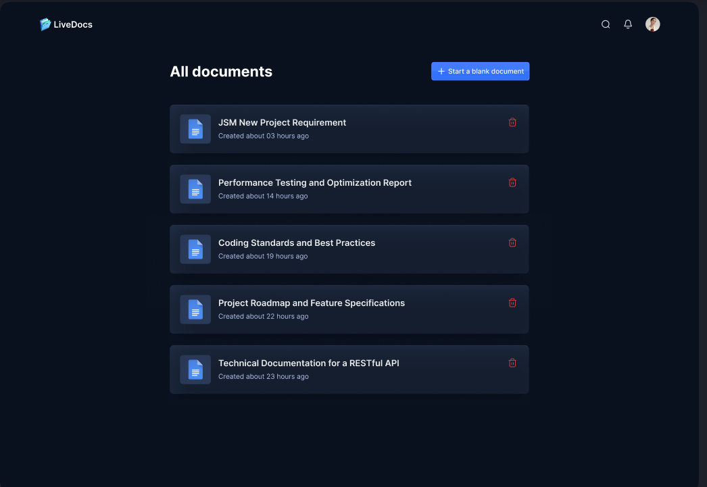
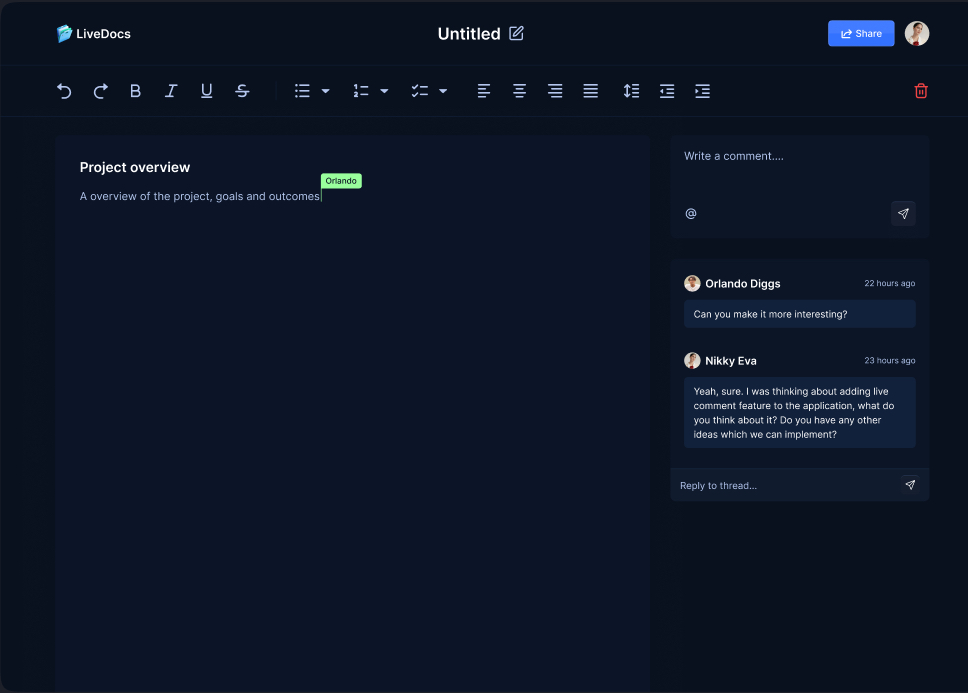
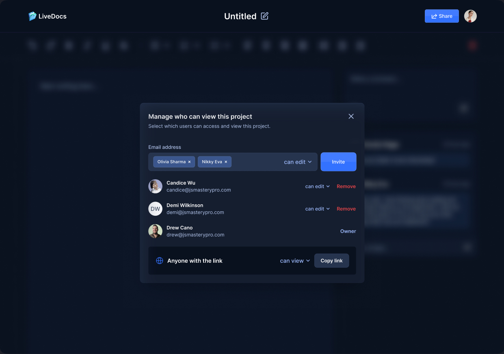
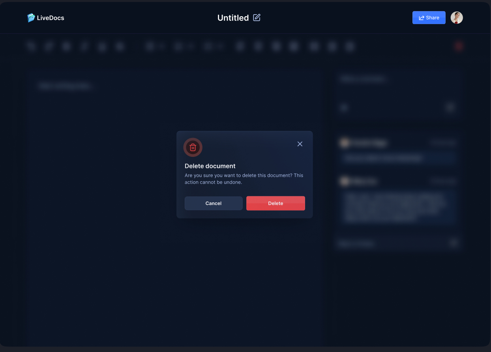

# Livedocs

Livedocs - Built with Next.js to handle the user interface, Liveblocks for real-time features and styled with TailwindCSS, LiveDocs is a clone of Goole Docs.

## Functionalities

👉 **Authentication**: User authentication using GitHub through NextAuth, ensuring secure sign-in/out and session management.

👉 **Collaborative Text Editor**: Multiple users can edit the same document simultaneously with real-time updates.

👉 **Documents Management**
   - **Create Documents**: Users can create new documents, which are automatically saved and listed.
   - **Delete Documents**: Users can delete documents they own.
   - **Share Documents**: Users can share documents via email or link with view/edit permissions.
   - **List Documents**: Display all documents owned or shared with the user, with search and sorting functionalities.

👉 **Comments**: Users can add inline and general comments, with threading for discussions.

👉 **Active Collaborators on Text Editor**: Show active collaborators with real-time presence indicators.

👉 **Notifications**: Notify users of document shares, new comments, and collaborator activities.

👉 **Responsive**: The application is responsive across all devices.

and many more, including code architecture and reusability

## Technologies 

- Next.js
- TypeScript
- Liveblocks
- Lexical Editor
- ShadCN
- Tailwind CSS

## Screenshots

## Getting Started

To run the project locally, follow these steps:

1. Clone the repository: `git clone <repository_url>`
2. Navigate to the project directory: `cd livedocs`
3. Install dependencies: `npm install`
4. Start the development server: `npm run dev`
